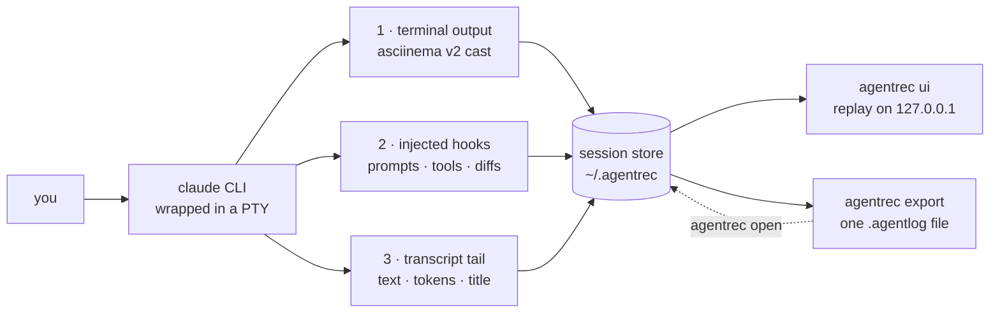

<div align="center">

# agentrec

**Git has history for your code. agentrec has history for how it was made.**

[](https://github.com/someflydays/agentrec/actions/workflows/ci.yml)
[](https://www.npmjs.com/package/agentrec)
[](LICENSE)
[](package.json)



</div>

## Why

A Claude Code session is the most detailed record of how a change got made — and it evaporates the
moment you close the terminal. Scrollback truncates, tool calls scroll past unrecorded, and "why did
it touch that file?" becomes unanswerable an hour later. agentrec wraps the real `claude` CLI
in a PTY and records the whole session locally on three synchronized channels: the terminal
exactly as you saw it, every tool call with its inputs and outputs, and per-request token usage.
You get a replayable, scrubbable, shareable session — one file you can attach to a bug report so
someone else can watch what actually happened.

## Quick start

```bash
npm install -g agentrec   # 1. install (Node >= 22.13)
agentrec claude                # 2. record — claude behaves exactly as it always does
agentrec ui                    # 3. replay in a local dashboard
```

Recordings land in `~/.agentrec`. List them at any time:

```console
$ agentrec ls
ID          TITLE                         AGE  DUR  PROMPTS  TOOLS  TOKENS  COST
01K1YQ7P8Z  Add watchdog timer to poller  4m   12m        3     41  284.1k  $0.42
01K1YMT3XR  Fix flaky auth test           2h    6m        2     18   96.4k  $0.15
```

No account, no daemon, no config file to write. `npx agentrec claude` works for a one-off
recording without installing anything.

## Features

- Wraps the real `claude` CLI in a PTY — same TUI, same keybindings, same behavior.
- Records terminal **output** as a standard asciinema v2 cast. Keystrokes are never captured.
- Captures structured events via temporarily injected Claude Code hooks: prompts, every tool call
  with inputs and outputs, file edits as diffs, notifications, and turn boundaries.
- Tails the Claude Code transcript for assistant text, per-request token usage, and the session
  title.
- Event timeline synced to a terminal replay: play, pause, change speed, scrub to any moment.
- Per-model token and cost breakdown from a bundled pricing snapshot.
- File-change diffs collected per session, so you can see what the agent touched and how.
- Live sessions stream into the dashboard over SSE while they are still running.
- `export` bundles a session into one portable `.agentlog` file; `open` imports it anywhere.
- `export --redact` scrubs credentials from the exported copy before you share it.
- `search` runs full-text search across every recorded session, down to the matching event.
- `diff` compares two runs of the same task: what differed in tools, files, commands, and cost.
- `fork` reruns a session from any point with a changed instruction (experimental).
- Search, diff, and fork are in the dashboard too: a search palette, a linkable diff view, and
  "fork from here" on any timeline row.
- Everything is local: no telemetry, no network calls, dashboard bound to `127.0.0.1`.
- `agentrec ls --json` for scripting.

## How it works



The three channels exist because no single one is sufficient. The PTY is ground truth for what you
actually saw, but it is a stream of escape codes with no structure. Hooks give structure — a real
list of tool calls with arguments — but say nothing about rendering or token spend. The transcript
carries the assistant's text and per-request usage. Recording all three against one clock means the
timeline and the terminal replay stay in sync, and every number in the cost breakdown traces back to
a specific request. See [docs/architecture.md](docs/architecture.md) for the details.

Hooks are injected per-invocation with Claude Code's `--settings` flag. Your own settings files are
never read, written, or modified.

## The session format

Each session is a directory named after a [ULID](https://github.com/ulid/spec) — sortable by start
time — under `~/.agentrec/sessions/`:

| File            | What it is                                                              |
| --------------- | ----------------------------------------------------------------------- |
| `meta.json`     | Session identity: id, wrapped command, cwd, start/end, exit code, title  |
| `events.jsonl`  | Append-only event log, one JSON object per line: `{seq, t, type, data}`  |
| `terminal.cast` | The terminal recording, asciinema v2, output and resize events only      |

`terminal.cast` is a plain asciicast, so `asciinema play`, `agg`, and anything else in that
ecosystem works on it directly — the dashboard is a convenience, not a lock-in. Set
`AGENTREC_HOME` to store sessions somewhere other than `~/.agentrec`.

The full spec, including every event type and its payload shape, is in
[docs/format.md](docs/format.md).

## Sharing sessions

`export` packs `meta.json`, `events.jsonl`, and `terminal.cast` into a single gzipped
`.agentlog` file. `open` unpacks one back into the local store, where it replays like any session
you recorded yourself.

```bash
agentrec export 01K1YQ7P8Z       # pack one session into a .agentlog file
agentrec open watchdog.agentlog  # unpack someone else's back into your store
agentrec ui                      # replay it exactly like your own
```

Session ids can be given as an unambiguous prefix, so `01K1YQ7P8Z` is enough. Attach the
`.agentlog` to an issue and a maintainer can watch the exact session that went wrong instead of
reading a paraphrase of it. Read [Privacy and security](#privacy-and-security) before you do.

## Working with recordings

Recordings are only useful if you can find things in them, compare them, and share them safely.

```bash
agentrec search "flaky watchdog"        # full-text across prompts, tool IO, and file paths
agentrec diff 01K1YQ7P8Z 01K1YMT3XR     # what differed between two runs of the same task
agentrec export 01K1YQ7P8Z --redact     # pack a session with credentials scrubbed
```

`search` indexes every session into a local SQLite index and returns the matching events with
their timestamps, so you can jump straight to the moment in the replay. `diff` pairs up turns and
tool calls between two sessions and reports what actually changed — commands, files, failures,
tokens, cost. Both are read-only over the stored JSONL, which stays the source of truth.

### Fork and replay (experimental)

Rerun a session from any point with a different instruction:

```bash
agentrec fork 01K1YQ7P8Z --list --experimental              # pick a fork point
agentrec fork 01K1YQ7P8Z --at 12 --experimental --dry-run   # see the plan first
agentrec fork 01K1YQ7P8Z --at 12 --prompt "use a fake clock instead" --experimental
```

This truncates the session's Claude Code transcript at the chosen event and resumes from there, so
the agent picks up with the same context but a new instruction — and the fork is itself recorded.
It depends on Claude Code transcript internals that are not a public contract, which is why it is
gated behind `--experimental` and refuses to run against an unrecognized version rather than
producing a corrupted session. Your **working tree is not rewound**: forking replays the
conversation, not the files on disk.

## Privacy and security

The recorder is local-only by construction:

- **No telemetry, no accounts, no uploads.** The only network listener is the dashboard, and it
  binds `127.0.0.1` — nothing is exposed on your network.
- **Terminal input is never recorded.** Only output and resize events are written to the cast. A
  secret you typed that the terminal did not echo never reaches disk.
- **Your Claude Code config is untouched.** Hooks are passed per-invocation via `--settings`;
  the recorder does not modify `~/.claude/settings.json` or any project settings file.
- **Everything stays in one directory.** `~/.agentrec` (or `AGENTREC_HOME`). Deleting a
  session directory deletes the recording.

What a recording *does* contain is whatever was on screen, plus tool inputs and outputs, your
prompts, and file diffs. If a command printed an API key, that key is in the cast. Treat
`.agentlog` files like application logs: review before sharing, and don't post one publicly without
looking at it first. Automatic secret redaction on export is on the roadmap and does not exist yet.

Full threat model, including exactly what is and is not captured:
[docs/privacy.md](docs/privacy.md).

## How it compares

|                          | agentrec       | Terminal scrollback | asciinema alone | Claude Code transcripts | Screen recording |
| ------------------------ | --------------------- | ------------------- | --------------- | ----------------------- | ---------------- |
| Structured tool timeline | Yes                   | No                  | No              | Raw JSONL, no timeline  | No               |
| Terminal replay          | Yes                   | No                  | Yes             | No                      | Yes, as video    |
| Token / cost accounting  | Yes, per model        | No                  | No              | Raw usage fields        | No               |
| Shareable single file    | Yes, `.agentlog`      | Copy-paste          | Yes, `.cast`    | Machine-local paths     | Large video file |
| Works offline            | Yes                   | Yes                 | Yes             | Yes                     | Yes              |

asciinema is the closest neighbor, and agentrec uses its format on purpose — the difference
is the other two channels layered on the same clock.

## Roadmap

[docs/roadmap.md](docs/roadmap.md) has the design detail behind each item.

- [x] Secret redaction pass on export — `export --redact`
- [x] Full-text search across recorded sessions — `search`
- [x] Session diffing — `diff`
- [x] Fork and replay: rerun a session from any point with a changed instruction — `fork`
  (experimental)
- [x] Fork from the dashboard timeline, not just the CLI
- [x] Search and diff in the dashboard
- [ ] Adapters for coding agents other than Claude Code

## Contributing

Bug reports, format feedback, and PRs are all welcome. [CONTRIBUTING.md](CONTRIBUTING.md) covers
dev setup, the repo layout, and how to run the dashboard against a live recorder. Issues labeled
`good first issue` are scoped to be self-contained — a good place to start if you want one.

The monorepo is three packages:

| Package                     | Role                                        |
| --------------------------- | ------------------------------------------- |
| `@agentrec/core`      | Session format, event schema, storage       |
| `agentrec`       | Recorder, dashboard server, `.agentlog` I/O |
| `@agentrec/dashboard` | React replay UI                             |

## License

[MIT](LICENSE) © Derek Martin
