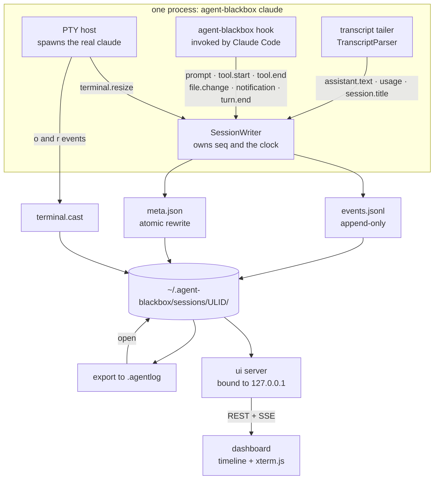

# Architecture

How Agent Black Box records a Claude Code session, where the data goes, and why it is shaped the
way it is.

## Components

| Package                     | Responsibility                                                                                  |
| --------------------------- | ----------------------------------------------------------------------------------------------- |
| `@agent-blackbox/core`      | The format. Event schema, session storage, asciicast reader/writer, pricing, summaries, HTTP API contract. No opinions about the CLI or the UI. |
| `@agent-blackbox/cli`       | The recorder (`claude` in a PTY), the hook receiver, the local dashboard server, `.agentlog` import/export. |
| `@agent-blackbox/dashboard` | The React replay UI: session list, event timeline, xterm.js terminal player, cost breakdown.      |

`core` ships two entry points. The default export needs Node (filesystem, zlib); the `./browser`
subpath export is deliberately dependency-free data handling — event types, asciicast parsing,
pricing, and the summary reducer — so the dashboard computes the same summaries from the same code
as the CLI, without pulling `node:fs` into the bundle.

## The three capture channels

The recorder writes one session from three independent sources. None of them is sufficient alone,
and the redundancy is the point.

### 1. The PTY: ground truth of what you saw

`agent-blackbox claude` spawns the real `claude` binary attached to a pseudo-terminal and proxies it
to your actual terminal. Claude Code stays a full interactive TUI: same rendering, same keybindings,
same behavior. Everything the child writes is teed into `terminal.cast`.

This channel is the only honest answer to "what was actually on the screen". It captures spinner
states, partially rendered output, the diff preview you approved, and the error you scrolled past —
none of which appear in any structured log.

Its limitation is that it is a stream of bytes and escape sequences. You cannot query it.

**Output only.** `CastWriter` emits asciicast `o` (output) and `r` (resize) events and has no method
for writing input. Keystrokes are never recorded, because keystrokes can carry secrets that were
never echoed to the screen.

### 2. Claude Code hooks: structured intent

Claude Code can invoke an external command at defined lifecycle points. The recorder passes a
generated hook configuration to the child process using the `--settings` flag, pointing those hooks
at `agent-blackbox hook`. Claude Code executes it with the hook payload on stdin; the receiver
normalizes that payload into session events and appends them to the log.

This channel gives the structure the PTY cannot: prompts as text, each tool call with its real
arguments and its result, file edits as diffs, notifications, and turn boundaries. It is what makes
the timeline navigable and the summary countable.

The hook configuration is per-invocation. `~/.claude/settings.json`, project settings, and local
settings are never read or written by the recorder — nothing survives the process, and nothing about
your Claude Code setup is changed by having recorded a session.

### 3. The transcript tail: text, tokens, and the title

Claude Code maintains its own JSONL transcript per session under
`~/.claude/projects/<project-slug>/<session-uuid>.jsonl`. The recorder tails that file for the three
things hooks do not carry: the assistant's prose, per-request token usage, and the AI-generated
session title.

Token usage only exists here, which makes this channel the sole basis for the cost breakdown.

## Data flow

Everything funnels through a single `SessionWriter`, which owns the sequence counter and the clock.
Event timestamps are milliseconds since `meta.startedAt`; cast timestamps are seconds since the same
instant. That shared origin is what lets the dashboard scrub the terminal and the event list
together — no clock reconciliation, no drift correction.

## Reading a session

Reads are cheap and derived. `SessionStore` loads `meta.json` and streams `events.jsonl`, and
`summarizeSession` folds the events into a `SessionSummary`: prompt count, tool counts by name, the
set of changed files, per-model usage and cost, and duration. Nothing is precomputed or cached on
disk, so a session that was interrupted mid-recording summarizes exactly as well as one that exited
cleanly — `durationMs` is simply `null` while `endedAt` is absent.

The dashboard server exposes this over a small same-origin API (`API_ROUTES` in `core/src/api.ts`):
session list, session detail, events, the raw cast, and an SSE stream. The stream carries three
message kinds — a new event, a new cast line, or session end — which is all a live session needs to
render incrementally.

## Design decisions

### Append-only JSONL for events

Events are appended with `appendFileSync` and never rewritten. The consequences are the reason for
the choice:

- A live session is readable by anything that can tail a file, so the dashboard follows a recording
  in progress with no coordination protocol.
- A crash — or a `kill -9` — costs at most the final partial line. `SessionStore.readEvents` skips
  lines that fail to parse rather than rejecting the file, so a torn write degrades one event
  instead of destroying the session. `parseCast` does the same for the cast.
- The first line of every log is a `session.start` event containing the full `SessionMeta`, which
  makes `events.jsonl` self-describing even if it gets separated from `meta.json`.

`meta.json` is the exception: it is mutable (title and end state arrive late), so it is rewritten
atomically via write-to-temp-then-rename. A reader never observes a half-written meta file.

### ULIDs for session ids

Session ids are ULIDs. They sort lexicographically by creation time, so `readdir` order is
chronological order and listing needs no index. They are collision-free without coordination, which
matters because two recordings can start in the same second in different terminals. And they are
case-insensitively prefix-searchable: `SessionStore.resolveId` accepts any unambiguous prefix, so
you type `agent-blackbox export 01K1YQ7P8Z` instead of all 26 characters. An auto-incrementing
integer would have required a shared counter; a UUID v4 would have sorted randomly.

### asciinema v2 for the terminal channel

The terminal recording is a standard asciicast, not a bespoke format. Recordings stay playable with
`asciinema play`, convertible with `agg`, and embeddable with the asciinema player, so the value of
a recording does not depend on this project continuing to exist. It also means the dashboard's
terminal player is a well-understood problem: feed the `o` payloads into xterm.js at their
timestamps.

Only `o` and `r` events are written. The format permits `i` (input) and `m` (marker); the recorder
never emits `i`.

### Token usage is deduplicated by `requestId`

This is the subtlest correctness detail in the codebase.

A single Claude API response is spread across multiple `assistant` lines in the Claude Code
transcript — one per content block, so thinking, text, and each `tool_use` land on separate lines.
Every one of those lines repeats the *same cumulative* usage object under the *same* `requestId`.
Summing usage per transcript line therefore multiplies real token spend by the number of content
blocks in the response, which inflates a reasoning-heavy turn severalfold.

`TranscriptParser` keeps a set of seen `requestId`s and emits exactly one `usage` observation per
API request. Every `usage` event in the log carries its `requestId`, so the deduplication is
auditable after the fact rather than a number you have to trust.

Two related rules in the same parser:

- **Sidechain (subagent) lines:** their text is dropped, because interleaving subagent prose with
  the main thread reads as nonsense, but their usage is kept, because that token spend is real.
- **Cache-creation tokens without a TTL breakdown:** when the transcript reports
  `cache_creation_input_tokens` but no `cache_creation` split, the whole amount is attributed to the
  cheaper 5-minute tier. Cost estimates lean low rather than inventing a 1-hour write.

### Cost is an estimate, and says so

`pricing.ts` is a bundled snapshot of Anthropic list pricing with cache multipliers derived from the
input rate (reads at 0.1x, 5-minute writes at 1.25x, 1-hour writes at 2x). `lookupPricing` resolves
exact ids, date-suffixed ids (`claude-haiku-4-5-20251001`), and provider-prefixed ids
(`anthropic.claude-opus-5`) by longest-prefix match.

An unknown model returns `null`, not a guess, and `SessionSummary.totalCostUsd` is `null` if *any*
contributing model is unpriced. A missing number is more useful than a wrong one, and a stale
snapshot cannot silently misreport a new model.

### One portable file for sharing

`.agentlog` is a gzipped JSON bundle of the three files plus a `version` field
(`core/src/agentlog.ts`). It is a container, not a second format — the meta and events inside are
byte-identical in shape to what is on disk, so importing is a write, not a translation. Import is
non-destructive by default: an id that already exists raises rather than overwriting.

## Related

- [Session format specification](format.md)
- [Security and privacy model](security.md)
