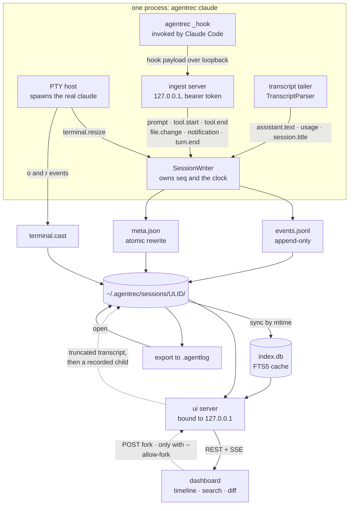

# Architecture

How agentrec records a Claude Code session, where the data goes, and why it is shaped the
way it is.

## Components

| Package                     | Responsibility                                                                                  |
| --------------------------- | ----------------------------------------------------------------------------------------------- |
| `@agentrec/core`      | The format. Event schema, session storage, asciicast reader/writer, search index, diffing, redaction, pricing, summaries, HTTP API contract. No opinions about the CLI or the UI. |
| `agentrec`       | The recorder (`claude` in a PTY), the hook receiver, the local dashboard server, fork, `.agentlog` import/export. |
| `@agentrec/dashboard` | The React replay UI: session list, event timeline, xterm.js terminal player, cost breakdown, search palette, diff view, fork panel. |

### Entry points and the `*-format.ts` split

`core` ships two entry points. The default export needs Node (`node:fs`, `node:zlib`,
`node:sqlite`); the `./browser` subpath export is deliberately dependency-free data handling — event
types, the API contract, asciicast parsing, diffing, pricing, search result shapes, and the summary
reducer — so the dashboard computes the same summaries, renders the same diffs, and highlights the
same snippets using the same code as the CLI, without pulling `node:fs` into the bundle.

Where a feature has both a pure part and a filesystem part, the pure part lives in a `*-format.ts`
module that the browser entry re-exports, and the part that touches disk lives beside it:

| Pure (`./browser` and Node)                    | Node only                                          |
| ---------------------------------------------- | -------------------------------------------------- |
| `cast-format.ts` — `parseCast`, header/event types | `cast.ts` — `CastWriter`, which streams to a file |
| `search-format.ts` — result shapes, snippet delimiters and `splitSnippet` | `search.ts` — the FTS5 index itself |

The rule is one-directional: a `*-format.ts` module never imports a Node builtin, and its filesystem
counterpart re-exports it (`search.ts` does `export * from "./search-format.js"`) so Node callers
still see one module.

## The three capture channels

The recorder writes one session from three independent sources. None of them is sufficient alone,
and the redundancy is the point.

### 1. The PTY: ground truth of what you saw

`agentrec claude` spawns the real `claude` binary attached to a pseudo-terminal and proxies it
to your actual terminal. Claude Code stays a full interactive TUI: same rendering, same keybindings,
same behavior. Everything the child writes is teed into `terminal.cast`.

This channel is the only honest answer to "what was actually on the screen". It captures spinner
states, partially rendered output, the diff preview you approved, and the error you scrolled past —
none of which appear in any structured log.

Its limitation is that it is a stream of bytes and escape sequences. You cannot query it.

**Output only.** `CastWriter` emits asciicast `o` (output) and `r` (resize) events and has no method
for writing input. Keystrokes are never recorded, because keystrokes can carry secrets that were
never echoed to the screen.

### 2. Claude Code hooks: structured intent

Claude Code can invoke an external command at defined lifecycle points. The recorder passes a
generated hook configuration to the child process using the `--settings` flag, pointing every hook
at the CLI's own hidden `_hook` subcommand.

A hook runs as a short-lived child process of the agent, not of the recorder, so the two need a
rendezvous point. The recorder starts an ingest server on `127.0.0.1:0` before spawning the agent
and passes its URL and a random bearer token down in the environment (`AGENTREC_INGEST_URL`,
`AGENTREC_INGEST_TOKEN`). `agentrec _hook` reads the payload on stdin, POSTs it there, and stays
mute — it never writes to stdout or stderr and never exits non-zero, because a hook that fails
degrades the session it is observing. The recorder answers the request first and maps the payload
into events afterwards, so a slow map never blocks the agent.

This channel gives the structure the PTY cannot: prompts as text, each tool call with its real
arguments and its result, file edits as diffs, notifications, and turn boundaries. It is what makes
the timeline navigable and the summary countable.

The hook configuration is per-invocation. `~/.claude/settings.json`, project settings, and local
settings are never read or written by the recorder — nothing survives the process, and nothing about
your Claude Code setup is changed by having recorded a session.

### 3. The transcript tail: text, tokens, and the title

Claude Code maintains its own JSONL transcript per session under
`~/.claude/projects/<project-slug>/<session-uuid>.jsonl`. The recorder learns that path from the
first hook payload and tails the file for the three things hooks do not carry: the assistant's
prose, per-request token usage, and the AI-generated session title.

Tailing polls the file size every 400ms rather than using `fs.watch`: watch events are coalesced and
platform-dependent, and give no byte offset to resume from. A shrinking file (Claude Code recreates
the transcript on `/clear`) resets the offset.

Each line that yields an observation is also read for its `uuid`, which is stamped onto the emitted
`assistant.text` and `usage` events as `transcriptUuid`. That is the identity a fork later uses to
cut the conversation at an exact line — byte offsets do not survive Claude Code rewriting the file
on compaction.

Token usage only exists here, which makes this channel the sole basis for the cost breakdown.

## Data flow

Everything funnels through a single `SessionWriter`, which owns the sequence counter and the clock.
Event timestamps are milliseconds since `meta.startedAt`; cast timestamps are seconds since the same
instant. That shared origin is what lets the dashboard scrub the terminal and the event list
together — no clock reconciliation, no drift correction.

## Reading a session

Reads are cheap and derived. `SessionStore` loads `meta.json` and streams `events.jsonl`, and
`summarizeSession` folds the events into a `SessionSummary`: prompt count, tool counts by name, the
set of changed files, per-model usage and cost, and duration. Summaries are recomputed per request
and never written to disk, so a session that was interrupted mid-recording summarizes exactly as
well as one that exited cleanly — `durationMs` is simply `null` while `endedAt` is absent. The only
derived artifact that does live on disk is the search index, and it is disposable.

`diffSessions` is the other reducer over the same events: it splits each session into turns at its
prompts, pairs turns across the two sessions by prompt-word similarity, then aligns the tool calls
inside a pair by name through a longest-common-subsequence pass. Alignment is a heuristic and says
so; the `totals` block is not, being exact counts over all events on each side.

## The `ui` server

`agentrec ui` is a plain `node:http` server bound to `127.0.0.1` — never `0.0.0.0` — serving both
the API and the dashboard bundle from one origin, so the SPA needs no CORS and no configuration.

Every request first passes the Origin/Host guard in `server/security.ts` (see
[the privacy model](privacy.md#the-ui-server-and-forking) for what it defends against and how).
After that, `router.ts` dispatches on the pathname:

| Route                             | Method | Response                                                       |
| --------------------------------- | ------ | -------------------------------------------------------------- |
| `/api/capabilities`               | GET    | What this instance permits, plus the per-process token          |
| `/api/sessions`                   | GET    | Summaries of every session, newest first                        |
| `/api/sessions/:id`               | GET    | `meta`, `summary`, and whether the session is live              |
| `/api/sessions/:id/events`        | GET    | Every parsed event                                              |
| `/api/sessions/:id/cast`          | GET    | The raw asciicast as `text/plain`; 404 when there is none       |
| `/api/sessions/:id/stream`        | GET    | SSE stream of a live session                                    |
| `/api/sessions/:id/fork-points`   | GET    | The events this session can be forked from, or why it cannot    |
| `/api/sessions/:id/fork`          | POST   | Starts a fork. **Only mounted under `--allow-fork`**            |
| `/api/search?q=&limit=&session=&type=` | GET | Search hits with snippets                                     |
| `/api/diff?a=&b=`                 | GET    | A `SessionDiff` between two sessions                            |

`:id` accepts an unambiguous id prefix, resolved the same way the CLI resolves one. Unknown `/api/`
paths are 404, a non-GET on a GET route is 405, and a handler that throws becomes a 500 rather than
an uncaught exception that would take the whole dashboard down over one bad session directory. Every
route shape lives in `core/src/api.ts`, so the server and the SPA cannot drift.

Anything that is not an API path is served from the dashboard's `dist` directory, with the usual
SPA fallback: an unknown path returns `index.html`, because the dashboard routes on the URL hash
(`#/session/<id>`, `#/diff/<a>/<b>`) and the server therefore needs no route table of its own.
Resolved paths that escape `dist` are refused. Content-hashed files under `assets/` are served
immutable; `index.html` is `no-store`, because the token meta tag injected into its `<head>` is
per-process and must never be cached.

Live follow is server-sent events. `handleSessionStream` tails `events.jsonl` and `terminal.cast`
from the current end of file, polling every 300ms, and emits one of three message kinds — a new
event, a new cast line, or session end. Only whole lines are decoded, so a torn write cannot deliver
half a UTF-8 sequence to the browser. That is all a live session needs to render incrementally.

## Search indexing

`agentrec search` and the dashboard palette query an SQLite FTS5 index at `<store>/index.db`. The
index is a cache: the JSONL files stay the source of truth, and any failure to open, read, or match
the schema version of the index is answered by deleting the file and rebuilding it, not by reporting
an error to the user.

- **Lazy load.** `node:sqlite` prints an experimental warning as it loads on Node 22 and 23, so it is
  resolved through `process.getBuiltinModule` on first use. A command that never searches never pays
  for it and never prints the warning.
- **Incremental by mtime.** `syncIndex` walks the store and reindexes a session only when it has to.
  An *ended* session whose `events.jsonl` matches the indexed `mtimeMs` and `size` byte-for-byte is
  skipped; a live one keeps growing, so it is always re-read. Sessions that have disappeared from
  disk are deleted from the index. Reindexing one session is a single transaction: delete its rows,
  reinsert them, upsert its row in `sessions`.
- **What gets indexed.** One FTS5 row per event that carries text: prompts, assistant text,
  notifications, titles, the string leaves of a tool input, tool output, and changed file paths.
  Whitespace is collapsed and only the first 20,000 characters of an event are indexed, because a
  single tool output can be megabytes.
- **Queries cannot be syntax errors.** FTS5 `MATCH` is a query language, so bare input like `foo:bar`
  or `"unclosed` would throw. Every whitespace-separated term is quoted into a phrase, reducing
  arbitrary input to an AND of literals. `raw` opts out for callers that want FTS5 syntax, and is the
  only path that can raise `SearchQueryError`.
- **Ranking and snippets.** Results are ordered by bm25, then newest session, then `seq`. Snippets
  come from FTS5 itself, wrapped in control-character delimiters that indexed text can never contain;
  `splitSnippet` in the browser-safe module turns them back into plain and matched runs, so the CLI
  and the dashboard highlight identically.

## Fork

`agentrec fork` and the dashboard's fork route answer the same question: what if this session had
gone differently from here? Both replay the conversation up to a chosen event and hand the agent a
new instruction.

The mechanism is transcript truncation. Claude Code can resume any session it still has a transcript
for, so forking means writing a *new* transcript that is a valid prefix of the original, then
resuming that:

1. **Locate the transcript.** `<config>/projects/<slug>/<agent-session-uuid>.jsonl`, where `<slug>`
   is the session's `cwd` with every non-alphanumeric character replaced by `-`. The slug is only a
   fast path; when it misses, the project directories are scanned for the file, so a change to the
   slug rule does not break forking.
2. **Map the event onto a line.** `assistant.text` and `usage` carry `transcriptUuid`, which
   resolves exactly; older recordings fall back to `requestId`, which identifies the same API
   response. A `prompt` came from a hook rather than the transcript, so it is matched by text and the
   cut lands *before* it — forking at a prompt means replaying the state that prompt was answered
   from. The last fallback is a timestamp lookup, and every fallback errs backwards: a miss shortens
   the fork rather than cutting past the intended point.
3. **Plan a valid prefix.** A line survives only if its `parentUuid` survived, so no kept line can
   reference a dropped one. The head then walks back to the last line where no `tool_use` is left
   unanswered by a `tool_result`, since a conversation ending mid-tool-call is not resumable.
   Metadata lines (no `uuid`) are kept unless they point at a uuid that was dropped. Every kept line
   is a fresh copy with its session id fields rewritten to a new UUID. The planner is pure — it
   reads the parsed lines and returns new ones.
4. **Write and resume.** The new transcript is written with the `wx` flag, so a fork can never
   clobber an existing session, and the original is only ever read. Then
   `claude --resume <new-id> --fork-session` runs under the recorder like any other session, with
   `forkedFrom: { sessionId, seq }` stamped into its meta.

**Why it is version-guarded.** Everything above depends on the shape of Claude Code's transcript
files, which is an internal detail and not a published contract. So before anything is written,
`checkForkSupport` requires that `claude --version` parses and is a supported major, and that the
transcript actually looks like one — conversation lines with `uuid`, `parentUuid`, `type` and
`sessionId`, and at least one assistant message. An unrecognized shape refuses the fork outright.
The guard is blunt on purpose: the failure mode it prevents is a silently corrupted session. On the
CLI the whole command additionally sits behind `--experimental`, with `--dry-run` to print the plan.

The two front ends differ only in how the child runs. The CLI fork takes over your terminal in a PTY
like a normal recording. The dashboard's runs the agent in print mode with piped stdio, since a
browser request owns no terminal; its cast is written at a fixed 80x24, and the browser's prompt is
passed as a single argv element to `spawn` — there is no shell anywhere in that path. One fork runs
per server at a time.

Neither rewinds your working tree. A fork replays the conversation, not the files on disk.

## Design decisions

### Append-only JSONL for events

Events are appended with `appendFileSync` and never rewritten. The consequences are the reason for
the choice:

- A live session is readable by anything that can tail a file, so the dashboard follows a recording
  in progress with no coordination protocol.
- A crash — or a `kill -9` — costs at most the final partial line. `SessionStore.readEvents` skips
  lines that fail to parse rather than rejecting the file, so a torn write degrades one event
  instead of destroying the session. `parseCast` does the same for the cast.
- The first line of every log is a `session.start` event containing the full `SessionMeta`, which
  makes `events.jsonl` self-describing even if it gets separated from `meta.json`.

`meta.json` is the exception: it is mutable (title and end state arrive late), so it is rewritten
atomically via write-to-temp-then-rename. A reader never observes a half-written meta file.

### ULIDs for session ids

Session ids are ULIDs. They sort lexicographically by creation time, so a directory listing is
already in chronological order and no index is needed to browse one. They are collision-free without
coordination, which matters because two recordings can start in the same second in different
terminals. And they are case-insensitively prefix-searchable: `SessionStore.resolveId` accepts any
unambiguous prefix, so you type `agentrec export 01K1YQ7P8Z` instead of all 26 characters. An
auto-incrementing integer would have required a shared counter; a UUID v4 would have sorted
randomly.

### asciinema v2 for the terminal channel

The terminal recording is a standard asciicast, not a bespoke format. Recordings stay playable with
`asciinema play`, convertible with `agg`, and embeddable with the asciinema player, so the value of
a recording does not depend on this project continuing to exist. It also means the dashboard's
terminal player is a well-understood problem: feed the `o` payloads into xterm.js at their
timestamps.

Only `o` and `r` events are written. The format permits `i` (input) and `m` (marker); the recorder
never emits `i`.

### Token usage is deduplicated by `requestId`

This is the subtlest correctness detail in the codebase.

A single Claude API response is spread across multiple `assistant` lines in the Claude Code
transcript — one per content block, so thinking, text, and each `tool_use` land on separate lines.
Every one of those lines repeats the *same cumulative* usage object under the *same* `requestId`.
Summing usage per transcript line therefore multiplies real token spend by the number of content
blocks in the response, which inflates a reasoning-heavy turn severalfold.

`TranscriptParser` keeps a set of seen `requestId`s and emits exactly one `usage` observation per
API request. Every `usage` event in the log carries its `requestId`, so the deduplication is
auditable after the fact rather than a number you have to trust.

Two related rules in the same parser:

- **Sidechain (subagent) lines:** their text is dropped, because interleaving subagent prose with
  the main thread reads as nonsense, but their usage is kept, because that token spend is real.
- **Cache-creation tokens without a TTL breakdown:** when the transcript reports
  `cache_creation_input_tokens` but no `cache_creation` split, the whole amount is attributed to the
  cheaper 5-minute tier. Cost estimates lean low rather than inventing a 1-hour write.

### Cost is an estimate, and says so

`pricing.ts` is a bundled snapshot of Anthropic list pricing with cache multipliers derived from the
input rate (reads at 0.1x, 5-minute writes at 1.25x, 1-hour writes at 2x). `lookupPricing` resolves
exact ids, date-suffixed ids (`claude-haiku-4-5-20251001`), and provider-prefixed ids
(`anthropic.claude-opus-5`) by longest-prefix match.

An unknown model returns `null`, not a guess, and `SessionSummary.totalCostUsd` is `null` if *any*
contributing model is unpriced. A missing number is more useful than a wrong one, and a stale
snapshot cannot silently misreport a new model.

### The search index is a cache, and is treated as one

Nothing in `index.db` is authoritative, so every failure path deletes it. A corrupt file, a lock, a
schema from an older version — all of them resolve to "throw it away and reindex" rather than an
error the user has to act on. That is only defensible because the JSONL files are the source of
truth and reindexing them is cheap; it is what lets the index be gitignored, deleted at will, and
left out of `.agentlog` bundles entirely.

### Fork points are limited to prompts and assistant turns

Only two event types are offered as fork points, and the reason is precision. A `prompt` resolves to
a transcript line by matching its text, and an `assistant.text` resolves by the `transcriptUuid`
recorded at capture time. Every other event type — tool calls, file changes, notifications — would
have to fall back to a timestamp lookup, and hook events run on a different clock than transcript
lines, so those cuts would be guesses. A fork that cuts one line off from where the user pointed is
worse than one that refuses to offer the point at all, because the resulting session looks correct.

The CLI's `--list` and the server's `/fork-points` therefore return the same two kinds, and the
fork route re-checks that the requested `seq` is one of them before it will run.

### One portable file for sharing

`.agentlog` is a gzipped JSON bundle of the three files plus a `version` field
(`core/src/agentlog.ts`). It is a container, not a second format — the meta and events inside are
byte-identical in shape to what is on disk, so importing is a write, not a translation. Import is
non-destructive by default: an id that already exists raises rather than overwriting, and an id that
is not a plain filesystem-safe token is refused before it can become a directory name.

## Related

- [Session format specification](format.md)
- [Security and privacy model](privacy.md)
